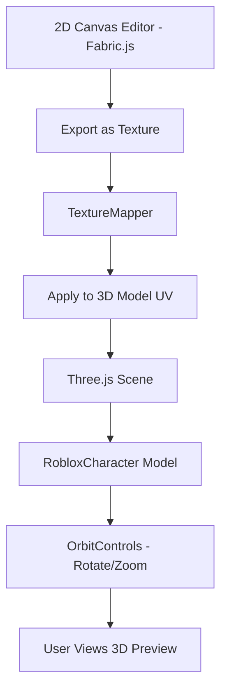
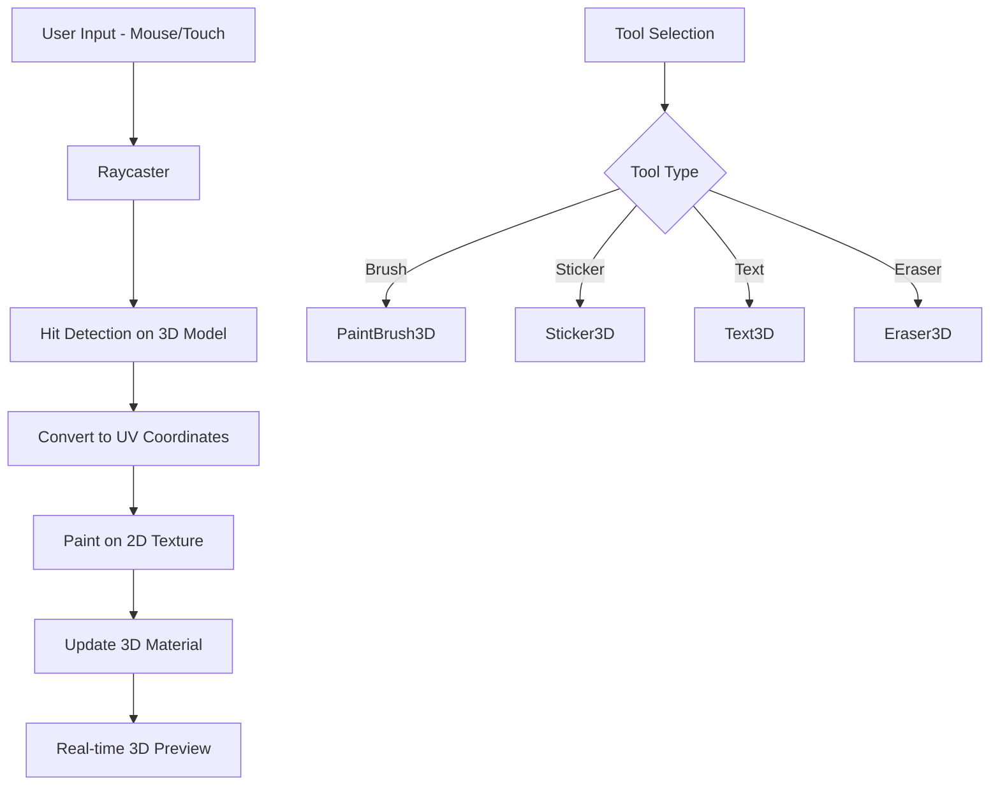
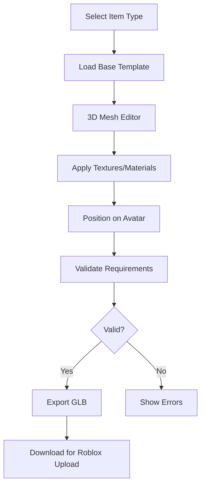
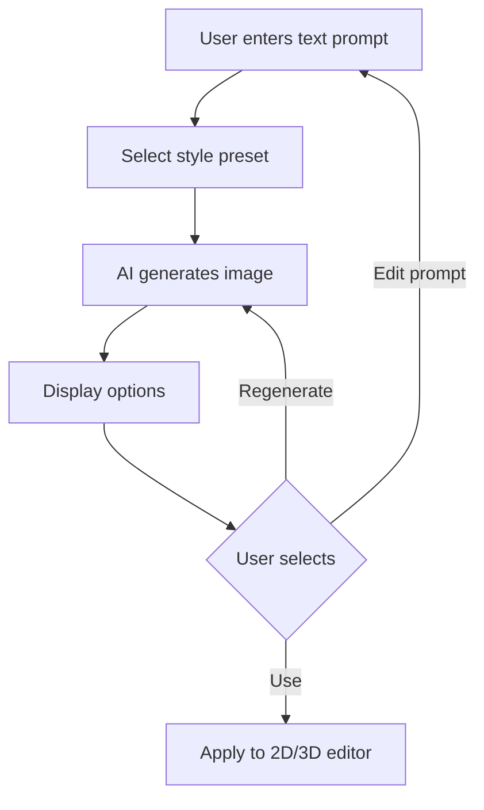

# 3D Design Platform Architecture

## Overview

This document outlines the architecture for building a comprehensive 3D design platform for Roblox items, similar to CustomUse. The implementation will be done in phases, starting with a 3D preview viewer and expanding to full 3D editing capabilities.

## Technology Stack

### Core 3D Libraries
- **Three.js** - Primary 3D rendering engine for WebGL
- **React Three Fiber** - React renderer for Three.js
- **@react-three/drei** - Useful helpers for React Three Fiber
- **@react-three/postprocessing** - Post-processing effects

### Supporting Libraries
- **Fabric.js** - Already integrated for 2D canvas editing
- **GLTFLoader** - For loading 3D Roblox character models
- **TextureLoader** - For applying 2D designs to 3D models

---

## Phase 1: 3D Preview Viewer

### Goal
Allow users to see their 2D T-shirt design wrapped on a 3D Roblox character model that can be rotated and zoomed.

### Components to Build

```
src/components/editor3d/
├── Preview3D.jsx           # Main 3D preview container
├── RobloxCharacter.jsx     # 3D character model component
├── TextureMapper.jsx       # Maps 2D canvas to 3D UV coordinates
├── CameraControls.jsx      # Orbit controls for rotation/zoom
└── index.js                # Exports
```

### Architecture Diagram



### Implementation Details

1. **3D Character Model**
   - Use a Roblox R15 character model in GLB/GLTF format
   - Model should have proper UV mapping for clothing
   - Separate mesh parts: torso, arms, legs, head

2. **Texture Mapping**
   - Convert Fabric.js canvas to data URL
   - Create Three.js texture from data URL
   - Apply texture to character's torso mesh
   - Handle UV coordinates for front/back placement

3. **Camera Controls**
   - Orbit controls for 360° rotation
   - Zoom in/out with scroll wheel
   - Touch support for mobile devices

### Key Files to Create

#### Preview3D.jsx
```jsx
// Main 3D preview component using React Three Fiber
// - Canvas setup with proper lighting
// - Load Roblox character model
// - Apply texture from 2D editor
// - Orbit controls for interaction
```

#### RobloxCharacter.jsx
```jsx
// 3D character model component
// - Load GLB model
// - Apply materials and textures
// - Handle different body parts
```

---

## Phase 2: Full 3D Clothing Editor

### Goal
Allow users to paint and design directly on 3D character models with real-time UV mapping.

### New Components

```
src/components/editor3d/
├── Editor3D.jsx            # Full 3D editor container
├── PaintBrush3D.jsx        # 3D painting tool
├── UVUnwrapper.jsx         # UV coordinate handling
├── MaterialEditor.jsx      # Material properties editor
├── LayerSystem3D.jsx       # 3D layer management
└── HistoryManager3D.jsx    # Undo/redo for 3D edits
```

### Features

1. **3D Painting**
   - Paint directly on 3D model surface
   - Brush size, color, opacity controls
   - Raycast to determine paint location
   - Real-time texture updates

2. **UV Editing**
   - View UV layout
   - Switch between 3D and 2D UV view
   - Seamless texture wrapping

3. **Material Properties**
   - Metallic/roughness controls
   - Normal map support
   - Emission for glowing effects

### Architecture Diagram



---

## Phase 3: UGC 3D Item Creation

### Goal
Enable creation of actual 3D accessories like hats, wings, glasses, and gear for Roblox UGC.

### New Components

```
src/components/ugc/
├── UGCEditor.jsx           # Main UGC item editor
├── MeshEditor.jsx          # Basic mesh manipulation
├── AccessoryPlacer.jsx     # Position accessories on avatar
├── AttachmentPoints.jsx    # Roblox attachment point system
├── ExportGLB.jsx           # Export to GLB format
└── RobloxValidator.jsx     # Validate against Roblox requirements
```

### Supported Item Types

1. **Head Accessories**
   - Hats, hair, face accessories
   - Attachment point: Head

2. **Back Accessories**
   - Wings, capes, backpacks
   - Attachment point: Back

3. **Shoulder Accessories**
   - Shoulder pads, pets
   - Attachment points: LeftShoulder, RightShoulder

4. **Waist Accessories**
   - Belts, tails
   - Attachment point: Waist

### Roblox UGC Requirements

- **Triangle Count**: Max 4,000 triangles
- **Texture Size**: 256x256 or 512x512
- **File Format**: GLB/GLTF or FBX
- **Attachment Points**: Must use Roblox standard attachment points

### Architecture Diagram



---

## Phase 4: AI-Powered Design Generation

### Goal
Use AI to generate designs from text prompts, similar to CustomUse's Text-to-Skin feature.

### Options for AI Integration

1. **OpenAI DALL-E API**
   - Generate images from text prompts
   - Requires API key and costs per generation

2. **Stable Diffusion API**
   - Open-source alternative
   - Can be self-hosted or use API services

3. **Replicate API**
   - Access to various AI models
   - Pay-per-use pricing

### Components

```
src/components/ai/
├── AIGenerator.jsx         # Main AI generation interface
├── PromptBuilder.jsx       # Help users create good prompts
├── StylePresets.jsx        # Pre-defined style options
├── GenerationHistory.jsx   # Track generated designs
└── AISettings.jsx          # API configuration
```

### User Flow



---

## File Structure Overview

```
src/
├── components/
│   ├── editor/              # Existing 2D editor
│   │   ├── EditorCanvas.jsx
│   │   ├── EditorToolbar.jsx
│   │   └── ...
│   ├── editor3d/            # Phase 1 & 2: 3D editor
│   │   ├── Preview3D.jsx
│   │   ├── Editor3D.jsx
│   │   ├── RobloxCharacter.jsx
│   │   └── ...
│   ├── ugc/                 # Phase 3: UGC creation
│   │   ├── UGCEditor.jsx
│   │   ├── MeshEditor.jsx
│   │   └── ...
│   └── ai/                  # Phase 4: AI generation
│       ├── AIGenerator.jsx
│       └── ...
├── models/                  # 3D model assets
│   ├── roblox-character.glb
│   ├── accessories/
│   │   ├── hat-template.glb
│   │   └── ...
│   └── templates/
├── lib/
│   ├── three-utils.js       # Three.js utilities
│   ├── uv-mapping.js        # UV coordinate helpers
│   └── roblox-export.js     # Roblox format exporters
└── hooks/
    ├── useThreeScene.js     # Three.js scene management
    ├── useTexture.js        # Texture loading/updating
    └── useRaycast.js        # 3D raycasting
```

---

## Dependencies to Add

```json
{
  "dependencies": {
    "@react-three/fiber": "^8.15.0",
    "@react-three/drei": "^9.88.0",
    "@react-three/postprocessing": "^2.15.0",
    "three": "^0.158.0",
    "three-stdlib": "^2.28.0"
  }
}
```

---

## Implementation Priority

### Phase 1 (Current Focus) - 3D Preview
1. Install Three.js and React Three Fiber
2. Create basic 3D scene with lighting
3. Load Roblox character model
4. Implement texture mapping from 2D canvas
5. Add orbit controls for rotation
6. Integrate with existing 2D editor

### Phase 2 - 3D Painting
1. Implement raycasting for 3D painting
2. Create brush tools for 3D surface
3. Add UV view toggle
4. Implement material editor

### Phase 3 - UGC Items
1. Create accessory templates
2. Implement attachment point system
3. Add mesh validation
4. Create GLB exporter

### Phase 4 - AI Generation
1. Integrate AI API
2. Create prompt interface
3. Add style presets
4. Implement generation history

---

## Next Steps

1. **Approve this architecture plan**
2. **Switch to Code mode to implement Phase 1**
3. **Install required dependencies**
4. **Create 3D preview component**
5. **Integrate with existing 2D editor**

Would you like to proceed with implementing Phase 1 (3D Preview Viewer)?